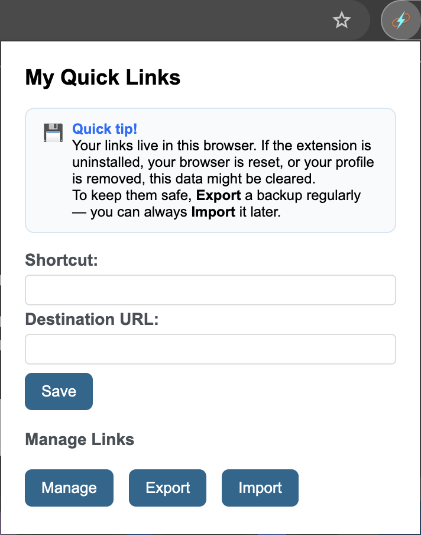
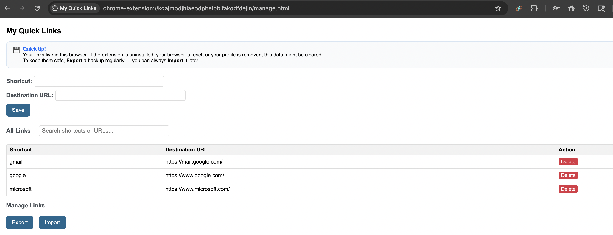

# My Quick Links

A lightweight Chromium-based browser extension to create, manage, and quickly access your favorite sites using custom short links with the `my` omnibox keyword.

Easily create and manage your own custom shortcuts for frequently used sites. Use easy-to-remember keywords that feel natural to you, right from your browser. With the `my` omnibox keyword, you can instantly jump to any site you’ve set up—just type `my <shortcut>` in the address bar. 

Build simple keywords for complex or lengthy URLs to navigate, saving time and effort. This is perfect for boosting productivity, reducing repetitive typing, and keeping your most-used links at your fingertips. Whether you’re a power user or just want a faster way to access your go-to sites, this extension streamlines your browsing experience.

## Features

- Quickly navigate to predefined URLs by typing `my <shortcut>` in the browser address bar.
- Add, edit, and delete shortcuts via a clean management page.
- View all shortcuts for easy access.
- Export and import your shortcuts and their corresponding URLs as a JSON file for backup or port it to different Chromium based browser.
- Works on Chrome and Edge on both Mac and Windows.
- Shows the suggested keywords with urls based on user's input.
- Robust validations and error handling.

## Install Extension

- [Chrome Web Store](https://chromewebstore.google.com/detail/my-quick-links/kgajmbdjhlaeodphelbbjfakodfdejln)
- [Edge Add-ons Store](https://microsoftedge.microsoft.com/addons/detail/naaafcbioeemoeapclljafgmnkeiaijb)

## Example Usage

```text
my gmail            → redirects to https://mail.google.com/
my google           → redirects to https://www.google.com/
my github pratham   → redirects to https://github.com/pratham-p
my github microsoft → redirects to https://github.com/microsoft
```

## Screenshots

myQuickLinks Extension


Suggestions


Manage Quick Links
